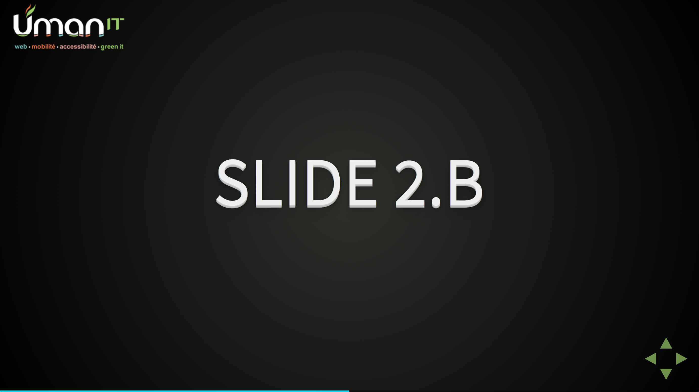

# umanit-reveal-js

This is a Reveal.js theme for our presentations.

Reveal.js documentation can be found [here](https://github.com/hakimel/reveal.js).

## If you're too lazy for reading the manual

Basically you juste have to write your presentation in `index.html`.
[Some examples](https://github.com/hakimel/reveal.js#instructions)

## Installation

First, run:
```
npm install
```

Then, execute `index.html` in your browser. That's all !


